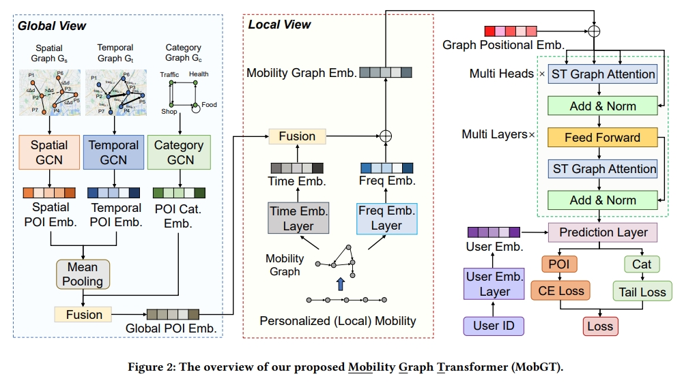

# [SIGSPATIAL 2023] Revisiting Mobility Modeling with Graph: A Graph Transformer Model for Next Point-of-Interest Recommendation

An implementation of MobGT (Revisiting Mobility Modeling with Graph: A Graph Transformer Model for Next Point-of-Interest Recommendation)

## Citation
```bash
@inproceedings{xu2023revisiting,
  title={Revisiting Mobility Modeling with Graph: A Graph Transformer Model for Next Point-of-Interest Recommendation},
  author={Xu, Xiaohang and Suzumura, Toyotaro and Yong, Jiawei and Hanai, Masatoshi and Yang, Chuang and Kanezashi, Hiroki and Jiang, Renhe and Fukushima, Shintaro},
  booktitle={Proceedings of the 31th International Conference on Advances in Geographic Information Systems},
  year={2023}
}
```

## Installation steps

If you're using python virtual environment, make sure to create a venv folder with python `3.7` or `3.8`

```bash
cd MobGT/
python -m venv venv
source venv/bin/activate
```

Afterwards, run the following commands to install python packages:

```bash
pip install -U pip
pip install torch==1.13.1+cu117 torchvision==0.14.1+cu117 torchaudio==0.13.1 --extra-index-url https://download.pytorch.org/whl/cu117
pip install pyg_lib torch_scatter torch_sparse torch_cluster torch_spline_conv -f https://data.pyg.org/whl/torch-1.13.0+cu117.html --force-reinstall
pip install torch_geometric
pip install wheel
pip install -r requirements.txt
```

## Data preparation

Please put and decompress the following dataset files into `dataset` directory at the <b><u>root</u></b> of the project.

- `foursquaregraph.7z`: Foursquare dataset
- `gowalla_nevda.7z`: Gowalla dataset
- `toyotagraph.7z`: Toyota dataset
- `poi-data.7z`: POI distance data files
- Copy all files from `dataset/baseline_models_dataset/` (`baseline_models_dataset.7z`)

## Project Organization

This project has been organized using 3 main folders.

1. `graphormer` - folder for the MobGT (STGTrans) project
2. `baseline_models` - baseline models for comparisson
3. `dataset` - all data used for training and testing both the proposed and baseline models

> NOTE: The commands for training and evaluation of each model are shown below. In order to illustrate how the output is, an example for one single epoch (epoch=1) is shown. However, the training files has as default greater number of epochs. Thus the results for more epochs will not be the same as the ones shown below.

## Training and evaluation of MobGT

In general the command to be executed is the following

```bash
cd graphormer
python entry.py --num_workers 8 --seed 1 --batch_size 16 --dataset_name foursquaregraph --gpus 1 --accelerator ddp --precision 16 --max_epochs 200 --ffn_dim 1024 --hidden_dim 128 --num_heads 8 --dropout_rate 0.1 --n_layers 6 --peak_lr 2e-4 --edge_type multi_hop --multi_hop_max_dist 20 --check_val_every_n_epoch 4 --warmup_updates 40000 --tot_updates 400000 --default_root_dir exps/<dataset_name>
```

### Training: Foursquare dataset

```bash
cd graphormer
python entry.py --num_workers 8 --seed 1 --batch_size 16 --dataset_name foursquaregraph --gpus 1 --accelerator ddp --precision 16 --max_epochs 200 --ffn_dim 1024 --hidden_dim 128 --num_heads 8 --dropout_rate 0.1 --n_layers 6 --peak_lr 2e-4 --edge_type multi_hop --multi_hop_max_dist 20 --check_val_every_n_epoch 4 --warmup_updates 40000 --tot_updates 400000 --default_root_dir exps/foursquaregraph/
```

### Training: Toyota dataset

Warning: It takes around 20-30 minutes per epoch with Toyota dataset, so please try it with fewer epochs at first.

```bash
cd graphormer
python entry.py --num_workers 8 --seed 1 --batch_size 16 --dataset_name toyotagraph --gpus 1 --accelerator ddp --precision 16 --max_epochs 200 --ffn_dim 1024 --hidden_dim 128 --num_heads 8 --dropout_rate 0.1 --n_layers 6 --peak_lr 2e-4 --edge_type multi_hop --multi_hop_max_dist 20 --check_val_every_n_epoch 4 --warmup_updates 40000 --tot_updates 400000 --default_root_dir exps/toyotagraph/
```

### Training: Gowalla dataset

Warning: It takes around 20-30 minutes per epoch with Toyota dataset, so please try it with fewer epochs at first.

```bash
cd graphormer
python entry.py --num_workers 8 --seed 1 --batch_size 16 --dataset_name gowalla_nevda --gpus 1 --accelerator ddp --precision 16 --max_epochs 200 --ffn_dim 1024 --hidden_dim 128 --num_heads 8 --dropout_rate 0.1 --n_layers 6 --peak_lr 2e-4 --edge_type multi_hop --multi_hop_max_dist 20 --check_val_every_n_epoch 4 --warmup_updates 40000 --tot_updates 400000 --default_root_dir exps/gowalla_nevda/
```

### Evaluation

Please just add `--test` argument to the training commands.

```bash
cd graphormer
python entry.py --num_workers 8 --seed 1 --batch_size 16 --dataset_name toyotagraph --gpus 1 --accelerator ddp --precision 16 --max_epochs 2 --ffn_dim 1024 --hidden_dim 128 --num_heads 8 --dropout_rate 0.1 --n_layers 6 --peak_lr 2e-4 --edge_type multi_hop --multi_hop_max_dist 20 --check_val_every_n_epoch 4 --warmup_updates 40000 --tot_updates 400000 --default_root_dir exps/toyotagraph/ --test
```

#### Example of output (Toyota, 1 epoch)

```
ACC @1: 0.0003, @5: 0.0009, @10: 0.0016
NDCG @1: 0.0003, @5: 0.0006, @10: 0.0008
MRR: 0.0013
```

If you want to train new model and disconsider the existent ones execute the command below:

```bash
rm -rf graphormer/exps/*
```

## Baseline Models

All the following baseline models have the same command to be train and tested. However, if it is desired to change the default parameters it, for now, necessary to change manually at each training file.

Dataset options `<dataset_type>`:

1. `toyota`
2. `gowalla`
3. `foursquare`

Regarding the evalution of baseline models, once the `train.py` be executed, it will show after the training the evaluation results (Acc@1, Acc@5, Acc@10, NDCG@1, NDCG@5, NDCG@10, MRR)

### Training and evaluation of LSTM

```bash
cd baseline_models/LSTM/
python train.py -dt <dataset_type ex: toyota>
```

#### Example of results output (Toyota)

```txt
==>Train Epoch:19 Loss:5.5005 lr:5e-05
==>Test [Acc@1, Acc@5, Acc@10, NCDG@1, NDCG@5, NDCG@10]: [0.13173492729382807, 0.24290396463973332, 0.2994192146315673, 0.13173492729382807, 0.18984936867627425, 0.20812322739393185] Loss::6.2744
==>Test [MRR]: 0.1893234137784137 Loss::6.2744
```

### Training and evaluation of LSTPM

```bash
cd baseline_models/LSTPM/
python train.py -dt <dataset_type ex: toyota>
```

#### Example of results output (Toyota)

```txt
epoch0: loss: tensor(5.8366, device='cuda:0', grad_fn=<DivBackward0>)
Scores:  [0.1329890142588846, 0.23854918428969, 0.2835428377197697, 0.1329890142588846, 0.18885384284651258, 0.20338215737195683, 0.1873599299935497]
```

### Training and evaluation of DeepMove

```bash
cd baseline_models/DeepMove/
python train.py -dt <dataset_type ex: toyota>
```

#### Example of results output (Toyota)

```txt
==>Test [Acc@1, Acc@5, Acc@10, NCDG@1, NDCG@5, NDCG@10]: [0.1236661545469111, 0.2456297602451762, 0.31114991424405164, 0.1236661545469111, 0.18675531110662474, 0.20797428140121066] Loss::6.0123
==>Test [MRR]: 0.18653992740492212 Loss::6.0123
single epoch time cost:17249.351979017258
```

### Training and evaluation of GetNext

```bash
cd baseline_models/GetNext/
python train.py -dt <dataset_type ex: toyota>
```

#### Example of results output (Toyota)

```
2023-09-13 18:49:57 Epoch 0/1
train_loss:16.8252, train_poi_loss:14.1238, train_time_loss:0.0664, train_cat_loss:2.0378, train_top1_acc:0.0275, train_top5_acc:0.0540, train_top10_acc:0.0681, train_top20_acc:0.0864, train_mAP20:0.0401, train_mrr:0.0431
val_loss: 21.6343, val_poi_loss: 18.7769, val_time_loss: 0.0799, val_cat_loss: 2.0589, val_top1_acc:0.0004, val_top5_acc:0.0013, val_top10_acc:0.0039, val_top20_acc:0.0079, val_mAP20:0.0013, val_mrr:0.0034,test_loss: 21.6343, test_poi_loss: 18.7769, test_time_loss: 0.0799, test_cat_loss: 2.0589, test_top1_acc:0.0004, test_top5_acc:0.0013, test_top10_acc:0.0039, test_top20_acc:0.0079, test_mAP20:0.0013, test_mrr:0.0034
```

### Training and evaluation of STAN

```bash
cd baseline_models/STAN/
python train.py -dt <dataset_type ex: toyota>
```

#### Example of results output (Toyota)

```txt
epoch:1, time:750.1781570911407, valid_acc:[0.03 0.07 0.08 0.09]
epoch:1, time:750.1783788204193, valid_ndcg:[0.03       0.04879136 0.05235343 0.05475155]
epoch:1, time:750.1784901618958, valid_mrr:[0.04656952]
epoch:1, time:750.1785712242126, test_acc:[0.07 0.14 0.16 0.18]
epoch:1, time:750.1786577701569, test_ndcg:[0.07       0.10265988 0.10914787 0.11400196]
epoch:1, time:750.1787436008453, test_mrr:[0.09778208]
```

### Training and evaluation of STRNN

```bash
cd baseline_models/STRNN/
python train.py -dt <dataset_type ex: toyota>
```

#### Example of results output (Toyota)

```txt
recall@1: 0.022132796780684104
recall@5: 0.04426559356136821
recall@10: 0.06338028169014084
ndcg@1: 0.022132796780684104
ndcg@5: 0.03403596637073449
ndcg@10: 0.04027854585648083
mrr: 0.03700242394389122
```

### Training and evaluation of Flashback

```bash
cd baseline_models/Flashback/
python train.py -dt <dataset_type ex: toyota>
```

#### Example of results output (Toyota)

```txt
~~~ Test Set Evaluation (Epoch: 70) ~~~
recall@1: 0.18394396
recall@5: 0.32855249
recall@10: 0.39247057
MAP 0.25632447
predictions: 126756.0
ndcg@1: 0.18394396
ndcg@5: 0.26060557
ndcg@10: 0.28126262
Mrr: 0.25632447
Epoch: 71/100
Used learning rate: 8e-05
Avg Loss: 4.147936990788875
Epoch: 72/100
Used learning rate: 8e-05
Avg Loss: 4.1414465973395425
Epoch: 73/100
Used learning rate: 8e-05
```

### Training and evaluation of MC (Markov Chains)

This model is a little different because the results of it can be seen when the `train.py` file for the `DeepMove` and `LSTM` is executed.

#### Example of results output (Toyota)

```txt
users:2261 markov:0.038673590033154195 train:34867 test:9802
users:2261 markov5acc:0.07685949379666387 train:34867 test:9802
users:2261 markov10acc:0.0924732556113768 train:34867 test:9802
users:2261 markovndcg:0.038673590033154195 train:34867 test:9802
users:2261 markov5ndcg:0.060240245514073684 train:34867 test:9802
users:2261 markov10ndcg:0.06529355821566483 train:34867 test:9802
users:2261 markovmrr:0.03157712705591754 train:34867 test:9802
```
